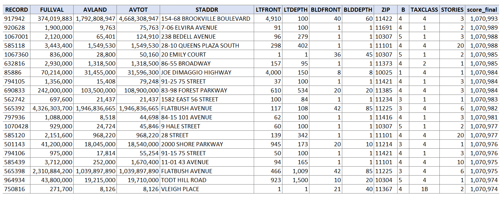

# NYC_Property_Anomaly_Detection
The goal of the project is to find potential real estate frauds from the NYC property data by detecting anomalies. The dataset represents the annual property valuation and assessment provided by the Department of Finance (DOF) from 2010 to 2011. The data is collected and entered into the system by various City employees, such as Property Assessors, Property Exemption specialists, ACRIS reporting, Department of Building reporting, and so on. The dataset contains 1,070,994 records with 32 fields.

# Summary
- For this project, I only use the following fields:
  - Property Size: LTFRONT, LTDEPTH, BLDFRONT, BLDDEPTH, STORIES
  - Property Value: FULLVAL, AVLAND, AVTOT
  - Location and Characteristics: B, BLOCK, LOT, ZIP, TAXCLASS
- I start by exploring the data and then impute the missing values in each field. To fill in the missing values, I find the relevant fields and use the median or mode of the field value which each record belongs to.
- Next, I create 45 expert variables which might be able to capture anomalies using different property value variables and different entities and reduce the dimensionality by performing Principal Component Analysis. 
- Then, I do the Z-scaling in order to center the Principal Components and treat them equally important. Each value now explicitly shows how unusual the record is in each dimension and I call the values Z-scores.
- Finally, I calculate the anomaly scores for each record in two ways and combine the scores after rank-ordering.
  - Simply combine the Z-scores using the Euclidean distance
  - Build a simple autoencoder based on the Z-scores. Then, calculate the distance between the input and output and combine them using Euclidean distance

# Conclusion
Top 20 anomaly records:

Based on the observation, I find the two cases of anomalies:
- Incorrect data inputs: most of the abnormal records have high scores because of the value 1 in BLDFRONT, BLDDEPTH, LTFRONT or LTDEPTH. After searching the addresses online, I conclude that most of them must be false entries.
- Mortgage fraud: some of the abnormal records have extremely high values in FULLVAL, AVLAND, AND AVTOT. This might be a sign of false reporting of land/property values to secure higher loans.
- Another type of fraud might be a tax avoidance fraud, an attempt to avoid tax by underrating the land/property value, but I do not see this type of anomaly in the top 20 list.

